# InQRess – Open-source QR Ticketing System

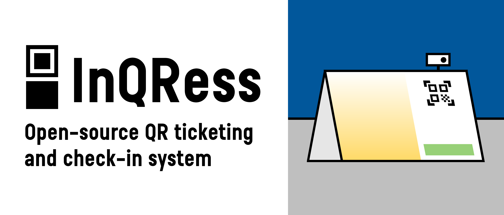

**InQRess** is a self-hosted, open-source QR code ticketing and check-in system for event organizers. A simple, cost-free alternative to proprietary ticketing platforms.

##  Quick Start

Get InQRess installed by running the interactive install script using the bash command below for a guided set up. [Docker](https://www.docker.com/) must be installed and running on your system before you start.

```bash
bash <(curl -fsSL https://raw.githubusercontent.com/bench352/inqress/main/install.sh)
```

See the **System Requirements** section below for more details.

## ✨ Key Features

### Secure QR Code ticket that cannot be forged

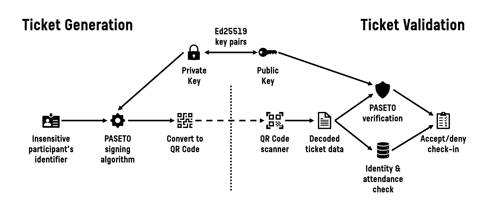

Only tickets created by you can be verified at your event. InQRess uses [PASETO (Platform-Agnostic SEcurity TOkens)](https://paseto.io/) to sign and verify each ticket with a unique key pair for your system, combined with real-time record checks to prevent reuse.

### No matter how your participant data looks, it'll work

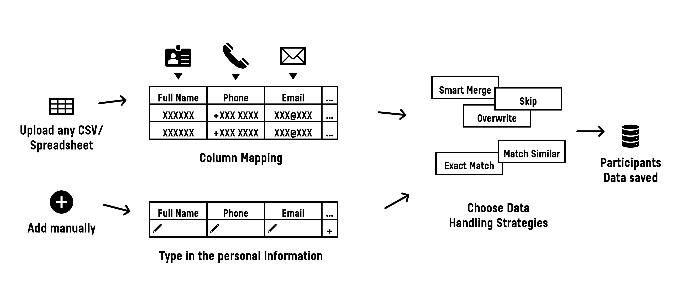

Bring your participants in via CSV or Excel spreadsheet (XLSX). Just map the columns during import, choose how InQRess should handle duplicates, and let the system do the rest!

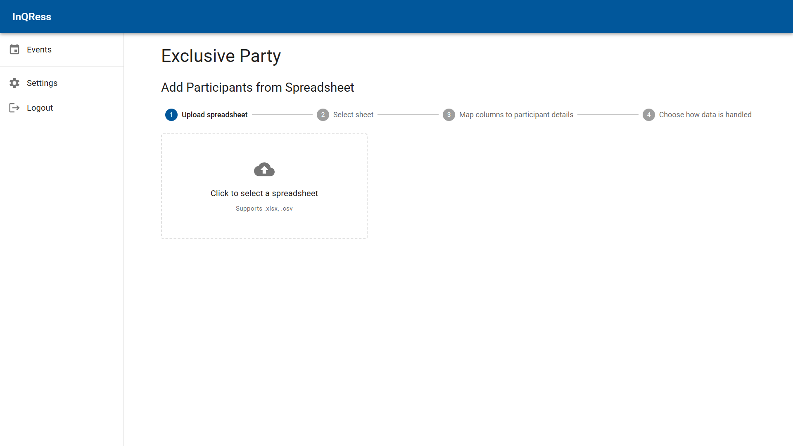
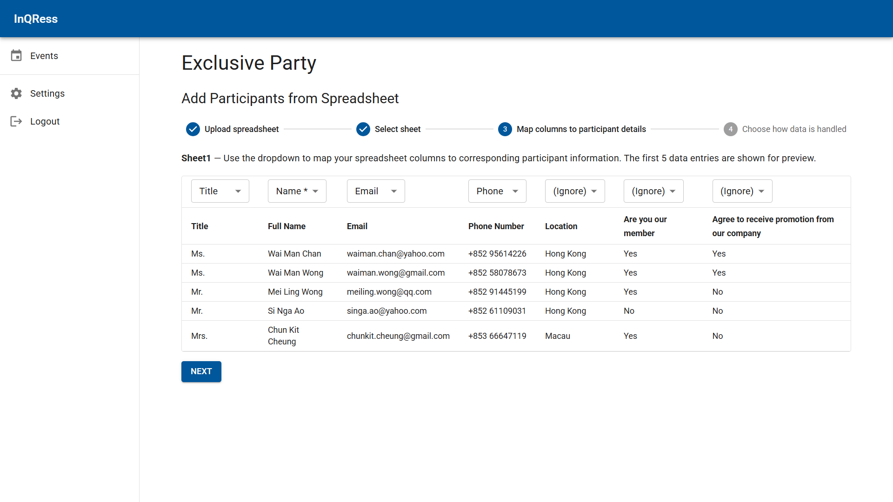
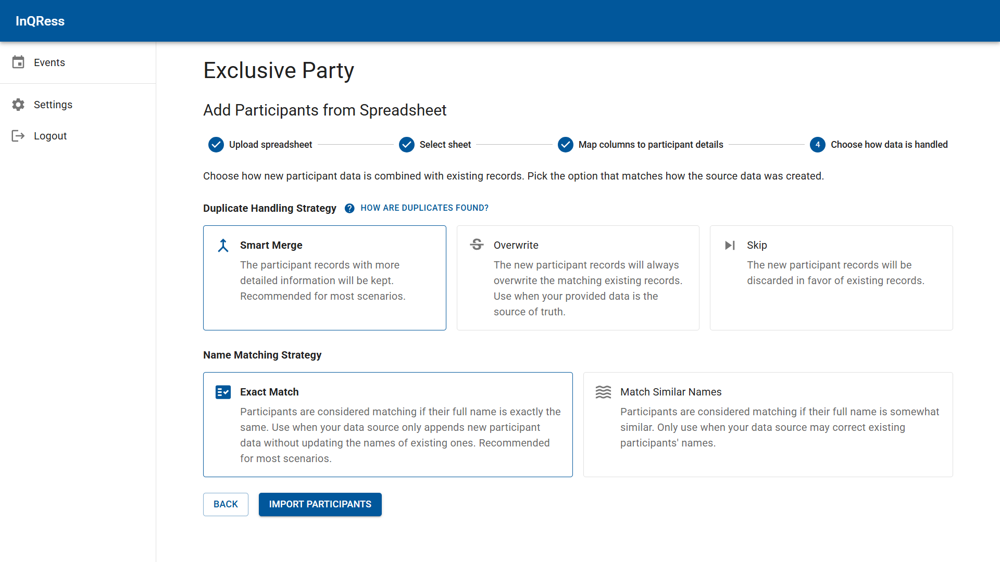

You can also add people manually on the spot.

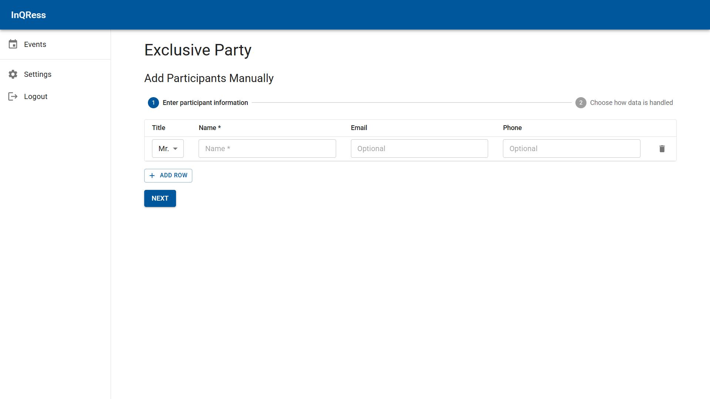

### Email your tickets to everyone in one click

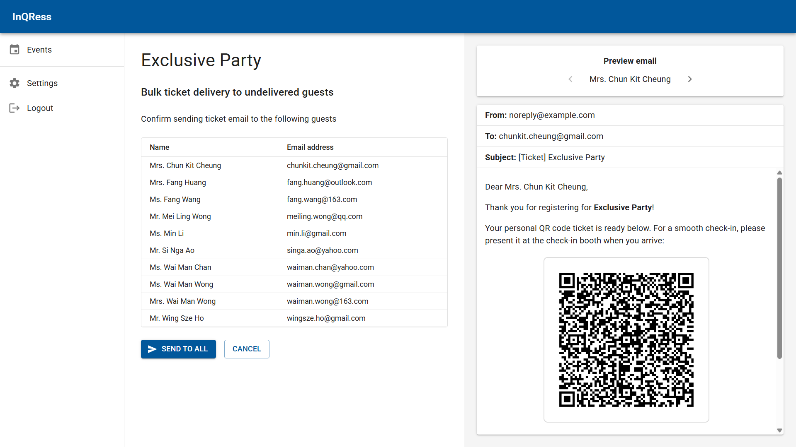

Delivering the QR Code ticket is just as easy. You can send your tickets to all your guests (with a registered email) at once! You can fully customize the email by editing the HTML template.

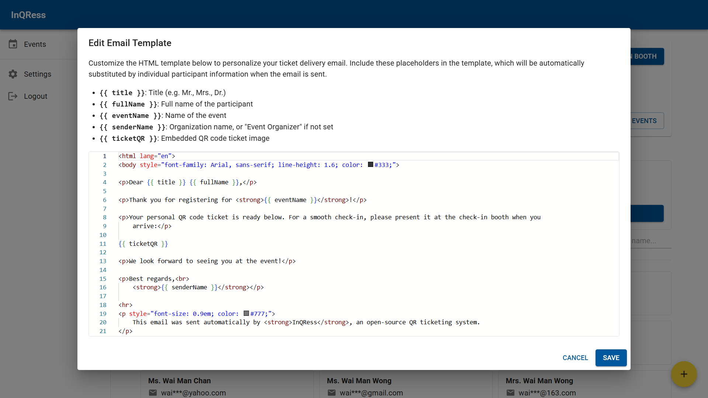

### Make your check-in booth personal

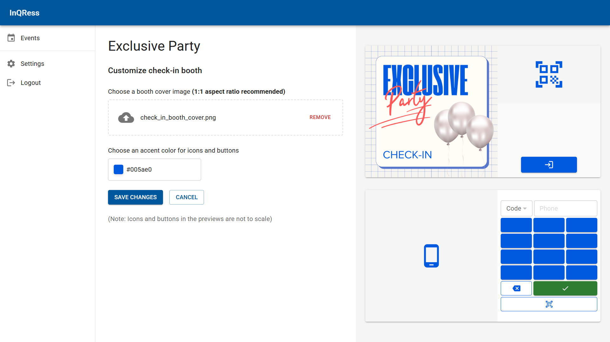

Make the guest check-in experience tailored to your event. You can set a custom booth cover image (1:1 aspect ratio recommended) and even change the accent color of the buttons and icons to color-match your cover!

### Hassle-free check-in by QR (or alternative methods)

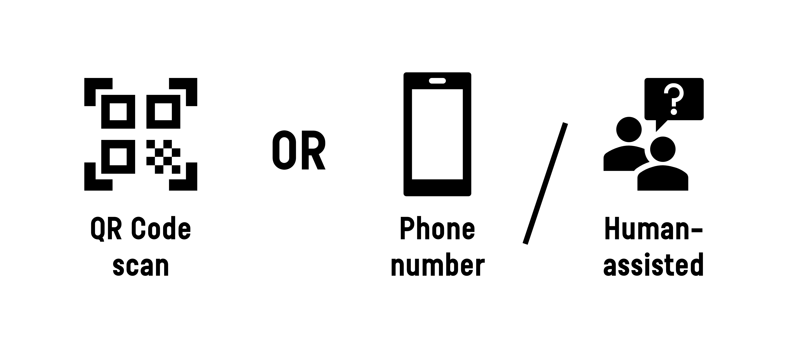

Hold the QR Code in front of the camera, get scanned, and the guest is checked in! (Below is the main screen of the check-in booth)

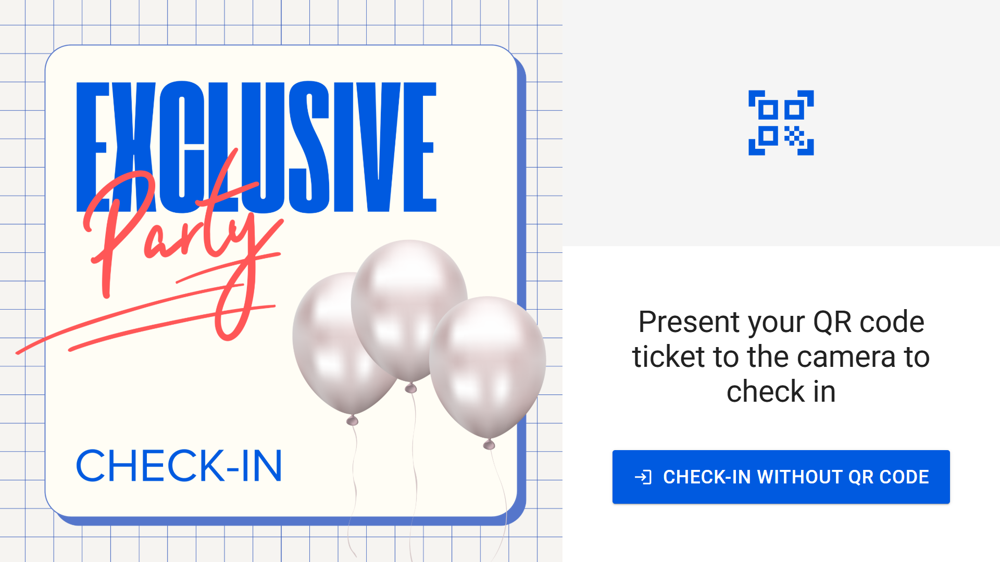

If the QR scan doesn't go through, or the guest can't pull up their QR Code ticket, they can still use their registered phone number to check in (with multiple country code support!)

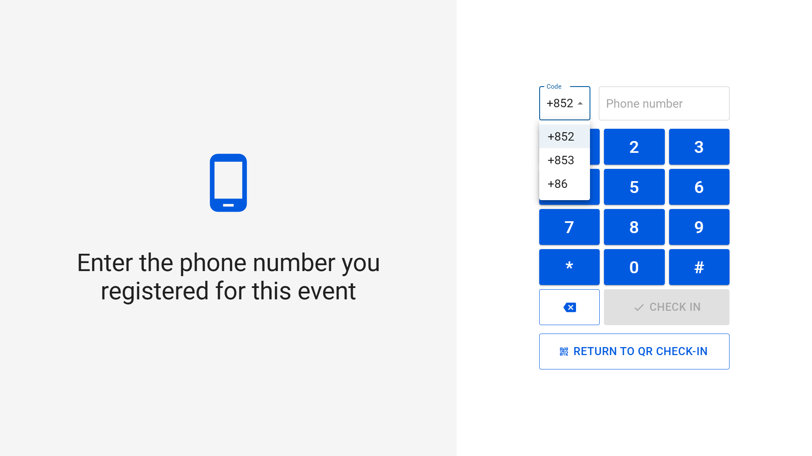

Or, if things are not going as expected, InQRess also supports the old-school way of checking guests in. Just ask for their name, find their personal details, and let them confirm on the booth screen!

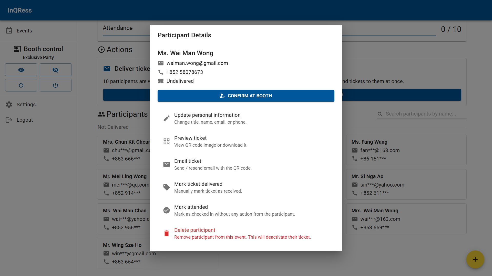
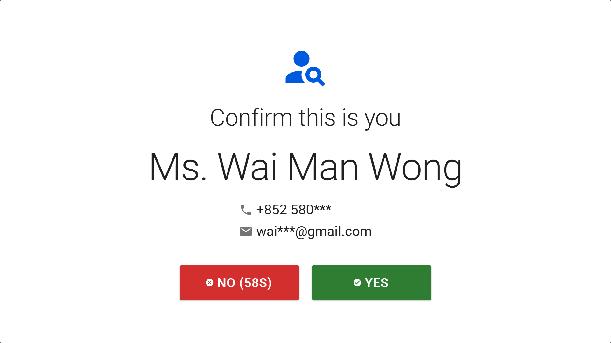

InQRess keeps track of attendance in real time, so you always know who has arrived and who hasn't.

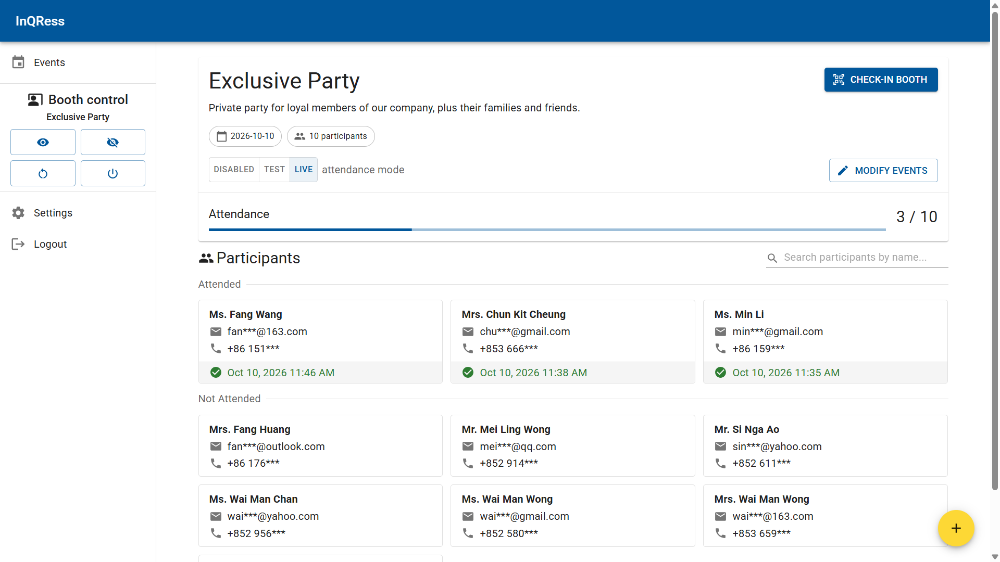

## 💻 System Requirements

**InQRess** can be installed on any ARM/X64 system with [Docker](https://www.docker.com/) installed.

To use the QR scanning feature, a **webcam must be connected to your device** and be [accessible by your browser](https://support.google.com/chrome/answer/2693767). Any webcam will work, but a high-quality model with **at least 1080p resolution (and ideally autofocus capability)** will greatly improve the success rate of QR scanning.

> **Note:** As a [security measure enforced by major web browsers](https://www.w3.org/TR/secure-contexts/), you need to deploy InQRess in **an environment with a "secure" connection to the web server**. Basically, you must access InQRess on your device (especially the check-in booth device) via:
>
> - `localhost`, which is [considered a "Secure Context" by W3C standard](https://www.w3.org/TR/secure-contexts/#localhost)
> - Endpoint exposed by an HTTPS load balancer/proxy (i.e. via `https://{domain-or-ip.to.your.instance}`)

The UI works best on a **1080p monitor**. The check-in booth UI is targeted for a **16:9 1080p touchscreen**.

**Credentials to an SMTP server** are also required for the email ticket delivery feature.

---

*This project is still at an early development stage and is not thoroughly tested. If you want to suggest a feature or encounter any bugs, please let me know by [opening an issue](https://github.com/bench352/inqress/issues)!*

***Disclaimer:** All personal data shown for illustration purposes are purely fictional and generated by [Google Gemini AI](https://gemini.google.com/). They are not intended to represent, or correlate to, any person in real life.*

*The booth cover image is customized from a template on [Canva](https://www.canva.com/).*